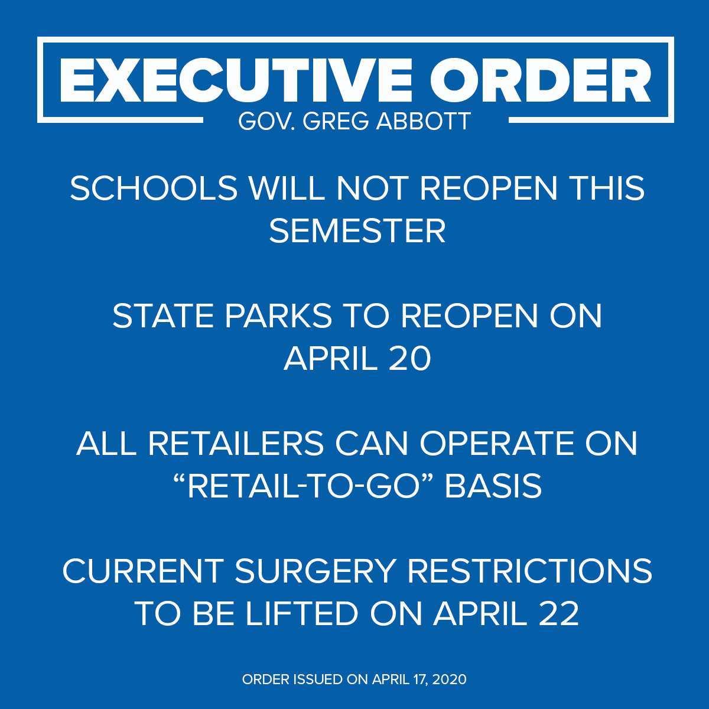

### April 17

- Total Cases in North Texas: 4,716 (+253)
- Total Deaths in North Texas: 123 (+8)

The bad news? That’s the biggest 1-day jump so far.  The good news?

> Cases continue to grow each day; however, log scale shows it is taking longer for case numbers to double. Something to watch!  
  
DFW Scanner (@DFWscanner) [April 18, 2020](https://twitter.com/DFWscanner/status/1251329788712824833)

- - - 

Our governor has a plan...

> [#NOW](https://twitter.com/hashtag/NOW?src=hash&ref_src=twsrc%5Etfw): [@GovAbbott](https://twitter.com/GovAbbott) issues executive order detailing how the Texas economy reopens with [#COVID19](https://twitter.com/hashtag/COVID19?src=hash&ref_src=twsrc%5Etfw). "We must be guided by data and by doctors. We must put health hand safety first."

 Jason Whitely (@JasonWhitely) [April 17, 2020](https://twitter.com/JasonWhitely/status/1251195293527347203)

> [#NOW](https://twitter.com/hashtag/NOW?src=hash&ref_src=twsrc%5Etfw): [@GovAbbott](https://twitter.com/GovAbbott) says "opening Texas must occur in stages. Not all businesses can open all at once on May 1st."

 Jason Whitely (@JasonWhitely) [April 17, 2020](https://twitter.com/JasonWhitely/status/1251196437204959238)

> [#NOW](https://twitter.com/hashtag/NOW?src=hash&ref_src=twsrc%5Etfw): [@GovAbbott](https://twitter.com/GovAbbott): "On Monday, April 27, we will announce additional ways to open Texas."  
>   
> They will include potentially reopening restaurants, etc. if they can maintain social distancing.

 Jason Whitely (@JasonWhitely) [April 17, 2020](https://twitter.com/JasonWhitely/status/1251198459211927553)

> .[@GovAbbott](https://twitter.com/GovAbbott) says phased opening strategy will require comprehensive testing and assurances from hospitals about readiness. Mentions April 27 as when restaurants and movie theaters MAY begin to reopen. ([@wfaa](https://twitter.com/wfaa))

William Joy (@WilliamJoy) [April 17, 2020](https://twitter.com/WilliamJoy/status/1251198684743847940)

- - -

If you read [yesterday's post](april-16), you'll recall that we're now required to wear masks and I mentioned it's a head scratcher. Well, things became more clear after an emergency meeting by the County Commissioners this morning. [They voted 3-2](https://www.dallasnews.com/news/public-health/2020/04/17/dallas-county-commissioners-vote-to-scale-back-county-wide-mask-order-reopen-crafts-stores/) to clarify that no one will be fined or incur the wrath of law enforcement if they don't wear a mask. It's still a good idea, so good in fact the Commissioners also voted to reopen craft stores to allow folks to buy the materials needed for homemade masks.

Yes, you heard me right. Craft stores are now essential businesses.

- - -

[San Diego Comic-Con Canceled Amid Coronavirus Pandemic](https://www.hollywoodreporter.com/amp/heat-vision/san-diego-comic-con-canceled-coronavirus-pandemic-1284432?__twitter_impression=true)

> San Diego Comic-Con has been canceled as the coronavirus pandemic continues to reshape how the world views large public gatherings. The annual entertainment and comic book convention was scheduled to take place from July 23-26 in San Diego, California. It will next occur July 22-25, 2021.