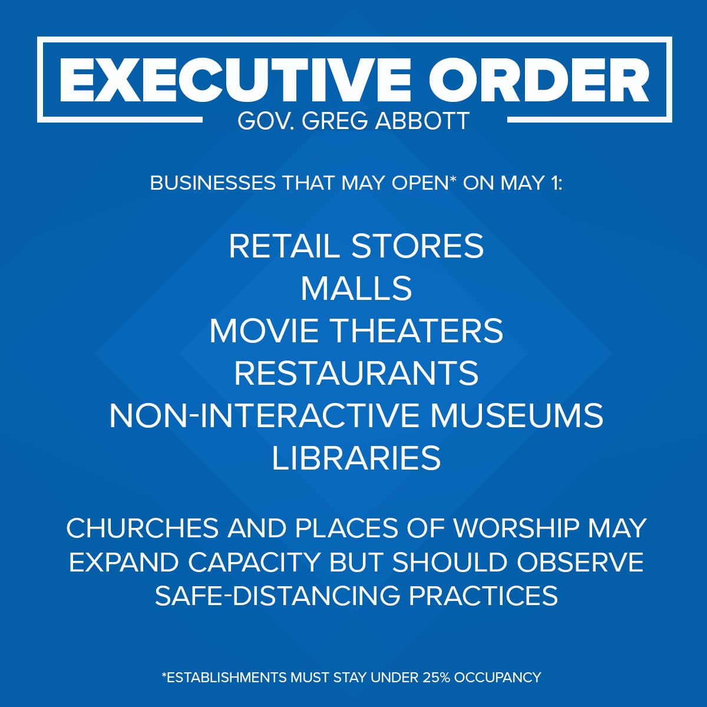
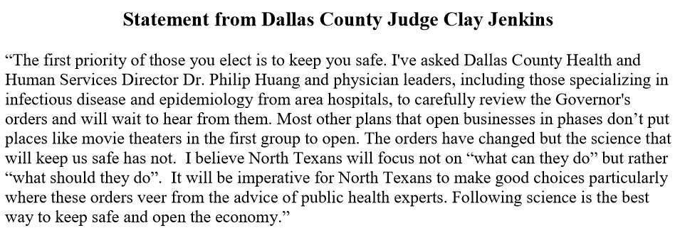

### April 27

-  Dallas County: 91 new cases and 2 deaths. 

Big day today. Governor Greg Abbott has announced a plan to start opening Texas back up.

Left out of the plan: bars, gyms, hair salons, but Gov. Abbott is planning on having them open mid-May. 

More:

> Texas Gov. Greg Abbott will end stay-home orders Thursday and let some businesses – malls, restaurants, theaters – reopen Friday at 25% capacity  https://www.cnn.com/2020/04/27/politics/texas-reopening-may-1-coronavirus/index.html [pic.twitter.com/Y9BWYjiRTE](https://t.co/Y9BWYjiRTE)

 CNN Breaking News (@cnnbrk) [April 27, 2020](https://twitter.com/cnnbrk/status/1254871163320311816)

> Restaurants in counties that have 5 or less covid-19 cases can operate at up to 50% capacity

 Claire Ballor (@claireballor) [April 27, 2020](https://twitter.com/claireballor/status/1254861114971533314)

> Gov. Abbott emphasized the need to continue social distancing practices, but it’s unclear what measures will be required of restaurants beyond limiting the number of diners.

 Claire Ballor (@claireballor) [April 27, 2020](https://twitter.com/claireballor/status/1254862742412034048)

But our county judge isn’t in love with the plan

> ***BREAKING***
>
> Dallas County [@JudgeClayJ](https://twitter.com/JudgeClayJ) is asking county health officials to review [@GovAbbott](https://twitter.com/GovAbbott)’s plan to reopen businesses on May 1st.
>
> Disagrees with opening places like movie theaters.
>
> Says he hopes people will focus on “what should they do” not “what can they do.” [pic.twitter.com/r2OS8X5ENJ](https://t.co/r2OS8X5ENJ)

 Matt Howerton (@HowertonNews) [April 28, 2020](https://twitter.com/HowertonNews/status/1254961328403472385)

There’s not much the judge can do since the Governor’s order takes precedence. 

As for me, I’m waiting and seeing. A lot of folks are suffering from “quarantine fatigue.” They could use the distraction. But we need accurate testing to ensure we’re not giving the virus more room to breed. And we need to keep people aware of social distancing, wearing masks, things like that. I can tell you that since we’ve had to wear masks in public, folks have **not** been keeping their distance. My fear is they may take this order as an all-clear when it’s really not.

Meantime, I understand people are suffering because they can’t work, that their businesses were shut down and that this gives them the opportunity to provide for their families again. That will be a relief. 

My family and I are still being careful. I suspect we’ll be more willing to venture out by August, barring any setbacks. 

