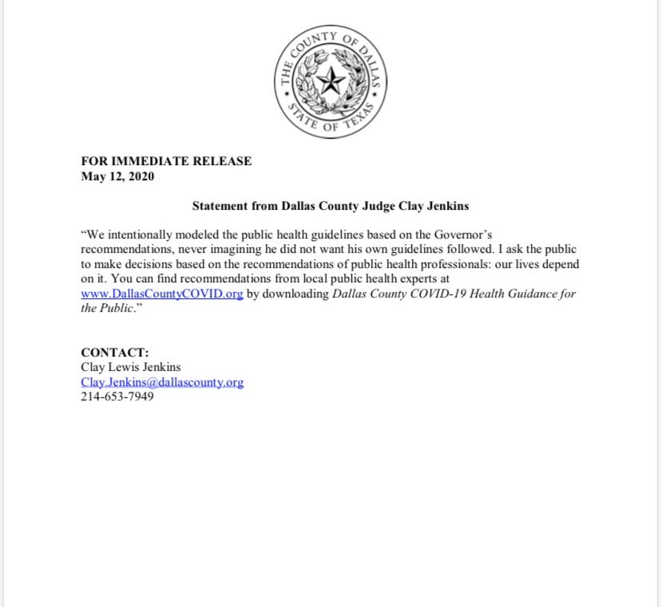

### May 12

- Dallas County: 6,359 total cases, 236 new cases, and 3 more deaths.

Dr. Fauci is testifying before the Senate today. It should be riveting television, but you'll need to find that out on your own.

---

Some people’s offspring...who would do such a thing?! Bootleg DVDs I get. But this?

> The masks are fakes. They don’t provide adequate protection. And they’re being handed to front-line caregivers. An [@AP](https://twitter.com/AP) investigation tracks counterfeit medical masks from China to U.S. hospitals.  https://apnews.com/850d9e6834fc71967af6d3dda65ad874

 The Associated Press (@AP) [May 12, 2020](https://twitter.com/AP/status/1260306881991577603)

- - -

The missus will be crushed now there's no reason to visit New York City until the fall:

> Breaking theater news: Broadway will remain closed at least until Labor Day.  https://www.nytimes.com/2020/05/12/theater/broadway-coronavirus.html?smid=tw-share

Michael Paulson (@MichaelPaulson) [May 12, 2020](https://twitter.com/MichaelPaulson/status/1260232305945305092)

---

This article sums up my view on staying home vs. **carefully opening up** nicely...[Quarantine Fatigue is Real](https://www.theatlantic.com/ideas/archive/2020/05/quarantine-fatigue-real-and-shaming-people-wont-help/611482/?utm_source=facebook&utm_medium=social&utm_campaign=share)

> The United States urgently needed to flatten the curve and buy time to scale up health-care capacity, testing, and contact tracing. But quarantine fatigue is real. I’m not talking about the people who are staging militaristic protests against the supposed coronavirus hoax. I’m talking about those who are experiencing the profound burden of extreme physical and social distancing. In addition to the economic hardship it causes, isolation can severely damage psychological well-being, especially for people who were already depressed or anxious before the crisis started. In a recent poll by the Kaiser Family Foundation, nearly half of Americans said that the coronavirus pandemic has harmed their mental health.

---

The superintendent for Dallas ISD is exploring all options for getting kids back to school...including this peculiar idea

> Superintendent tells me one plan being considered for DISD: bring ALL elementary students back to classrooms, possibly spread out in larger middle schools. They’re too young to be home alone. Secondary students would do more distance learning from home [#wfaa](https://twitter.com/hashtag/wfaa?src=hash&ref_src=twsrc%5Etfw) [#disd](https://twitter.com/hashtag/disd?src=hash&ref_src=twsrc%5Etfw) [pic.twitter.com/zszHGaA6qN](https://t.co/zszHGaA6qN)

Chris Lawrence (@clawrenceDFW) [May 13, 2020](https://twitter.com/clawrenceDFW/status/1260400770895302657)

- - -

Very good news from the Governor's Mansion:

> Texas governor announces $1-billion in food benefits for families of school kids who've lost access to free or discounted meals at school because of [#COVID19](https://twitter.com/hashtag/COVID19?src=hash&ref_src=twsrc%5Etfw). The [@USDA](https://twitter.com/USDA) funds provide $285/child to be used through SNAP program.  https://gov.texas.gov/news/post/governor-abbott-hhsc-announce-over-1-billion-in-pandemic-food-benefits-for-texas-families [#Hunger](https://twitter.com/hashtag/Hunger?src=hash&ref_src=twsrc%5Etfw) [#pandemic](https://twitter.com/hashtag/pandemic?src=hash&ref_src=twsrc%5Etfw)

David Schechter (@DavidSchechter) [May 12, 2020](https://twitter.com/DavidSchechter/status/1260297471697264642)

Ehh, not so much from the Attorney General's office:

> [#BREAKING](https://twitter.com/hashtag/BREAKING?src=hash&ref_src=twsrc%5Etfw): Texas Attorney General [@KenPaxtonTX](https://twitter.com/KenPaxtonTX)  
sends letter to [@JudgeClayJ](https://twitter.com/JudgeClayJ) saying Dallas Co. cannot limit attendees at churches, lawyers are essential businesses and county cannot require masks to be worn. Judges in Bexar, Travis counties got similar letters. [pic.twitter.com/CTNlFLjWpP](https://t.co/CTNlFLjWpP)

Jason Whitely (@JasonWhitely) [May 12, 2020](https://twitter.com/JasonWhitely/status/1260304800517967873)

But this evening , the Judge responded. 

> STATEMENT from Dallas County [@JudgeClayJ](https://twitter.com/JudgeClayJ) after the Texas Attorney General sent him a letter this afternoon saying the county pandemic order was too restrictive and in conflict with the state. [pic.twitter.com/58wp0Loa8g](https://t.co/58wp0Loa8g)

 Jason Whitely (@JasonWhitely) [May 12, 2020](https://twitter.com/JasonWhitely/status/1260336657565396994)

The tug of war between state and county officials continues!

---

Our behavior during this unprecedented age that we find ourselves in is messing with the robots that enhance our lives. [Our weird behavior during the pandemic is messing with AI models](https://www.technologyreview.com/2020/05/11/1001563/covid-pandemic-broken-ai-machine-learning-amazon-retail-fraud-humans-in-the-loop/?fbclid=IwAR0gAshW3-URTcPtE9pJEs35_zlgpUbSEOxlW7vowHQtIQEzZc62D8oH0lA)

> What’s clear is that the pandemic has revealed how intertwined our lives are with AI, exposing a delicate codependence in which changes to our behavior change how AI works, and changes to how AI works change our behavior. This is also a reminder that human involvement in automated systems remains key. “You can never sit and forget when you’re in such extraordinary circumstances,” says Cline.

Maybe the robot revolution has a few bugs to work out. 

- - -

Soon, walking along those black sand beaches will be a thing that you can do.

> Iceland expects to start lifting restrictions on international arrivals to the country "no later than June 15." Follow live updates:  https://www.cnn.com/webview/world/live-news/coronavirus-pandemic-05-12-20-intl/h_49c92d7d5e163f6d27185f9c593dac01 [pic.twitter.com/VqIMmUnHYp](https://t.co/VqIMmUnHYp)

CNN Breaking News (@cnnbrk) [May 12, 2020](https://twitter.com/cnnbrk/status/1260290166700285952)