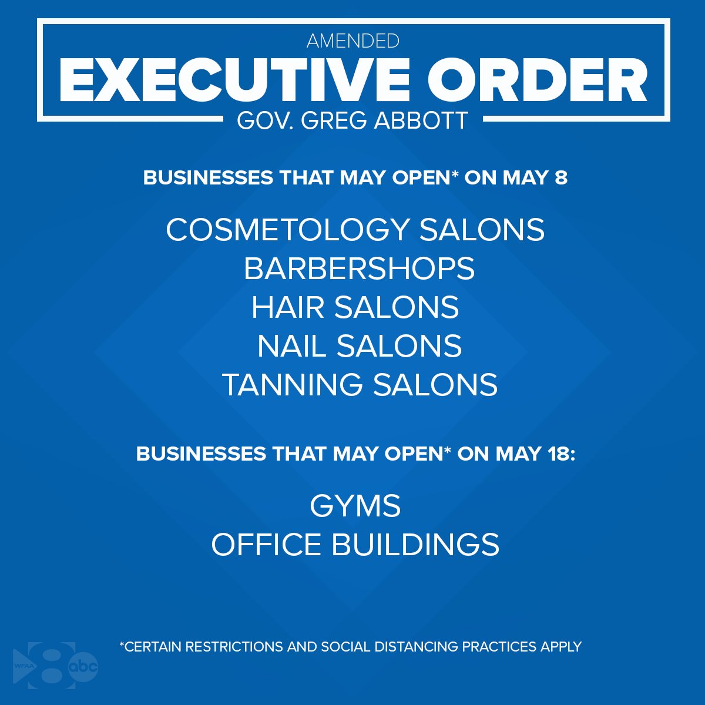

### May 5

- Dallas County: 4,623 total cases, 253 new cases, and 7 more deaths.

Happy Cinco De Mayo!

---

Our governor has outlined the next phase of business openings...

> [#BREAKING](https://twitter.com/hashtag/BREAKING?src=hash&ref_src=twsrc%5Etfw): Abbott says barber shops, nail salons, tanning salons, etc are allowed to open THIS FRIDAY May 8. Strongly recommend both customers and operators wear face masks. ([@wfaa](https://twitter.com/wfaa))

William Joy (@WilliamJoy) [May 5, 2020](https://twitter.com/WilliamJoy/status/1257765242672754692)

> [#NEW](https://twitter.com/hashtag/NEW?src=hash&ref_src=twsrc%5Etfw): Abbott adds gyms are allowed to open at 25% capacity May 18. Showers and locker rooms must remain closed. equipment disinfected after each use and customers wear gloves covering hands and fingers ([@wfaa](https://twitter.com/wfaa))

William Joy (@WilliamJoy) [May 5, 2020](https://twitter.com/WilliamJoy/status/1257766078580744192)

> [#Breaking](https://twitter.com/hashtag/Breaking?src=hash&ref_src=twsrc%5Etfw) [#Texas](https://twitter.com/hashtag/Texas?src=hash&ref_src=twsrc%5Etfw) governor says bars to remain closed for now. Still working on how to open them with safe distancing. And for input from bar owners for ideas

Jason Wheeler (@jasonwheelertv) [May 5, 2020](https://twitter.com/jasonwheelertv/status/1257766523277582336)

> [#Breaking](https://twitter.com/hashtag/Breaking?src=hash&ref_src=twsrc%5Etfw) [#Texas](https://twitter.com/hashtag/Texas?src=hash&ref_src=twsrc%5Etfw) governor says on May 18th businesses located in office buildings can open to 5 employees or 25% of workforce if employees maintain social distancing

Jason Wheeler (@jasonwheelertv) [May 5, 2020](https://twitter.com/jasonwheelertv/status/1257767517663133703)

Here's the complete list:

---

There’s two ways to look at this:

1. She’s an idiot who got what she deserved and isn’t it delicious irony that the Governor announces the day she can open her salon, she receives her sentence.
2. Look, she’s had bills mounting and it wasn’t feasible for her to keep her doors closed. She took a big risk and it didn’t pay off, but it won’t be a long stay in jail.

<https://www.wfaa.com/article/news/local/dallas-salon-owner-refused-close-sentenced-7-days-jail-ordered-pay-fines/287-beefb4d5-4bc9-4ecd-9661-420c14c75ce9>

---

Excellent news

> NOW: Dallas Co Cmsnrs pass resolution 4-1 allowing vote by mail for anyone concerned for health due to [#covid19](https://twitter.com/hashtag/covid19?src=hash&ref_src=twsrc%5Etfw) [@wfaa](https://twitter.com/wfaa) [pic.twitter.com/MSA6lbMPjT](https://t.co/MSA6lbMPjT)

David Goins (@dgoins) [May 5, 2020](https://twitter.com/dgoins/status/1257696800200208385)

---

Hitchcock did it better.

> Alabama police search for ‘aggressive chicken’ attacking people at ATMs | https://www.mystateline.com/
> https://www.mystateline.com/news/weird/alabama-police-search-for-aggressive-chicken-attacking-people-at-atms/

Jake Tapper (@jaketapper) [May 5, 2020](https://twitter.com/jaketapper/status/1257688331120500743)
